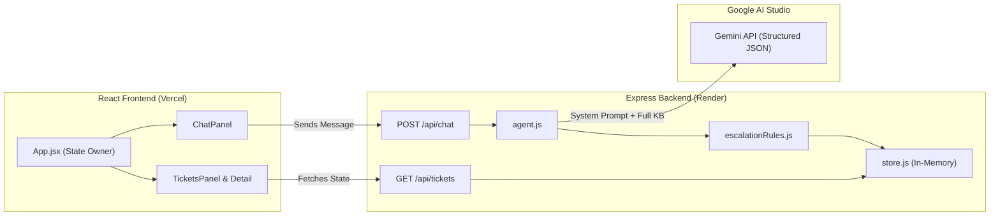

# Veridian Corp: Internal Service Agent

An AI-powered IT Support Helpdesk built for the AIONOS-A2 Assignment. This application features an autonomous support agent capable of resolving employee IT issues, referencing internal Knowledge Base (KB) policies, enforcing security guardrails, and managing an audit trail of tickets.

## 1. Live Working Prototype

👉 **Live Demo:** `aionos-assignment-one.vercel.app` (The backend may take a few seconds to load please wait on the UI.)
👉 **Backend API:** `https://aionos-assignment.onrender.com`
👉 **Demo Video:** `https://drive.google.com/drive/folders/1yIoZkHd_YdrkanyuAJClNeucqi31jrfb?usp=share_link`

*(Note: To test the app quickly, simply click "Start Session" on the landing page to use the pre-filled demo credentials.)*

## 2. Architecture and Process Flow

The application follows a decoupled client-server architecture deployed across Vercel and Render.



### Process Flow
1. **User Input:** The employee sends a message via the React `ChatPanel`.
2. **Context Assembly:** The Express backend (`agent.js`) intercepts the request and builds a system prompt containing the conversation history, the employee's details, and the *entire* Knowledge Base.
3. **AI Inference:** The Gemini API processes the prompt and returns a strictly typed JSON response conforming to a predefined schema (`reply`, `action`, `category`, `kbSource`, `escalatedTo`).
4. **Safety Overrides:** The response passes through `escalationRules.js`. Hardcoded regex rules intercept high-risk issues (e.g., Phishing, Finance server access, Contractor VPNs) and force an `escalation` action, overriding the LLM's decision if necessary.
5. **State & Audit:** The ticket is created or updated in the in-memory `store.js`, and an unalterable audit trail entry is appended.
6. **UI Update:** The frontend receives the agent's reply and triggers a refresh of the Tickets Panel to visually reflect the new state.

## 3. Inputs, Sources, and Assumptions Used

### Inputs & Sources
* **Knowledge Base (`kb.json`):** Contains KB-01 through KB-10 and the Asset Management Policy, transcribed verbatim from the assignment datapack.
* **Historical Tickets (`ticketHistory.json`):** Seed data for tickets TK-1042 through TK-1051 to provide the LLM with few-shot context of past resolutions.
* **Seed Requests (`seedRequests.json`):** Test cases provided in the datapack used to manually verify the robustness of the AI agent.

### Technical Assumptions
* **Context over RAG:** Given the relatively small size of the fictional Veridian Corp KB, a deliberate architectural choice was made to inject the *entire* KB into the system prompt context window rather than over-engineering a Vector Database (RAG) pipeline. This guarantees perfect recall and eliminates retrieval hallucination.
* **In-Memory Data Store:** Due to the ~6-hour time-box constraint of the assignment, persistent databases (PostgreSQL/MongoDB) were scoped out. Ticket state and audit trails are managed via an in-memory array (`store.js`) which resets upon server restart.
* **Deterministic Guardrails over AI Autonomy:** We assume that LLMs cannot be 100% trusted with security-critical IT policies. Therefore, hardcoded fallback overrides (`escalationRules.js`) take precedence over the AI's intended actions.

## 4. List of AI Tools Used and How They Were Used

1. **Google Gemini API (Runtime Engine):**
   * *How it was used:* Served as the core reasoning engine for the IT Service Agent. It was configured using `generationConfig.responseSchema` to guarantee the output was returned as structured JSON, completely eliminating the need for fragile string parsing.
2. **Google Antigravity / AGY (Autonomous Coding Agent):**
   * *How it was used:* Acted as a pair-programmer to accelerate development. It was used to generate detailed Markdown specifications before coding, scaffold the Vite/React frontend, and implement the Express backend API logic.
3. **Context7 MCP Server (Model Context Protocol):**
   * *How it was used:* Connected directly to the Antigravity coding agent to feed it real-time, up-to-date documentation for React and Vite. This ensured the generated frontend code utilized modern patterns without hallucinations.

---

## Local Development Setup

If you wish to run this project locally instead of using the deployed links:

**Prerequisites:** Node.js v18+ and a Gemini API Key.

**1. Backend**
```bash
cd server
npm install
# Create a .env file and add: GEMINI_API_KEY=your_key_here
npm run dev
```

**2. Frontend**
```bash
cd client
npm install
npm run dev
```
Navigate to `http://localhost:5173` in your browser.
